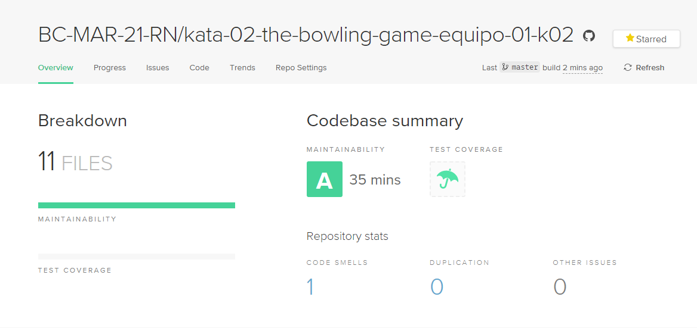

# Kata El Juego de Boliche

Photo by <a href="https://unsplash.com/@persnicketyprints?utm_source=unsplash&amp;utm_medium=referral&amp;utm_content=creditCopyText">Persnickety Prints</a> on <a href="https://unsplash.com/s/photos/bowling?utm_source=unsplash&amp;utm_medium=referral&amp;utm_content=creditCopyText">Unsplash</a>

## Pre-requisitos
- [Instalar y utilizar ESLint para mantener tu codigo consistente e identificar posibles problemas](https://eslint.org/)
- Integrar [CodeClimate](https://codeclimate.com/) CodeClimate a tu repositorio.

## Requerimientos funcionales
 

- The game consists of 10 frames as shown above. In each frame the player has two opportunities to knock down 10 pins. The score for the frame is the total number of pins knocked down, plus bonuses for strikes and spares.
- A spare is when the player knocks down all 10 pins in two tries. The bonus for that frame is the number of pins knocked down by the next roll. So in frame 3 above, the score is 10 (the total number knocked down) plus a bonus of 5 (the number of pins knocked down on the next roll.)
- A strike is when the player knocks down all 10 pins on his first try. The bonus for that frame is the value of the next two balls rolled.
- In the tenth frame a player who rolls a spare or strike is allowed to roll the extra balls to complete the frame. However no more than three balls can be rolled in tenth frame.

## Requerimientos no funcionales
- Calidad
  - Utilizar estilo de código definido por la comunidad (apoyarse en ESLint)
  - Puntuación **A** obtenida en CodeClimate
  - Incluir pruebas unitarias(Jest)
- Desempeño y escalabilidad
  - Puede ejecutarse desde la linea de comandos y mostrar la salida en consola
- Código fuente
  - Orientado a Objetos
  - Métodos Pequeños
  - Aplicar los principios [SOLID](https://medium.com/backticks-tildes/the-s-o-l-i-d-principles-in-pictures-b34ce2f1e898)

## Tecnologías
- Lenguaje de programación Javascript
- Línea de comando / consola

## Entregable
- Código fuente en Github (1 por equipo)

## Resources
- [Learn Javascript - Interactive tutorial](https://www.learn-js.org/)
- [Learn JavaScript (Step-By-Step)](https://learnjavascript.online/)
- [JavaScript Garden](https://bonsaiden.github.io/JavaScript-Garden/)
- [Eloquent JavaScript](https://eloquentjavascript.net/)
- [Try JavaScript](https://www.javascript.com/try)
- [JavaScript (ES2015+) Enlightenment](https://frontendmasters.com/books/javascript-enlightenment/)
- [JavaScript Fundamentals for ES6](https://www.pluralsight.com/courses/javascript-fundamentals-es6)
- [An intro to object-oriented programming in JavaScript: objects, prototypes, and classes](https://www.freecodecamp.org/news/an-intro-to-object-oriented-programming-in-javascript-objects-prototypes-and-classes-5d135e7361b1/)
- [JavaScript — Principios SOLID](https://medium.com/@mauriciogc/javascript-principios-solid-e93a17e950bb)
- [Understanding SOLID Principles in JavaScript](https://hackernoon.com/understanding-solid-principles-in-javascript-w1cx3yrv)
- [The Absolute Beginner’s Guide to Test Driven Development, with a Practical Example](https://medium.com/@bethqiang/the-absolute-beginners-guide-to-test-driven-development-with-a-practical-example-c39e73a11631) 
- [Learn Test Driven Development (TDD)](https://github.com/dwyl/learn-tdd)
- [Fundamentals of TDD](https://thoughtbot.com/upcase/fundamentals-of-tdd)
- [Getting Started](https://jestjs.io/docs/en/getting-started)
- [Getting Started With Jest](https://www.valentinog.com/blog/jest/) 
- [Testing JavaScript with Jest](https://flaviocopes.com/jest/)

# Calificación Code Climate
